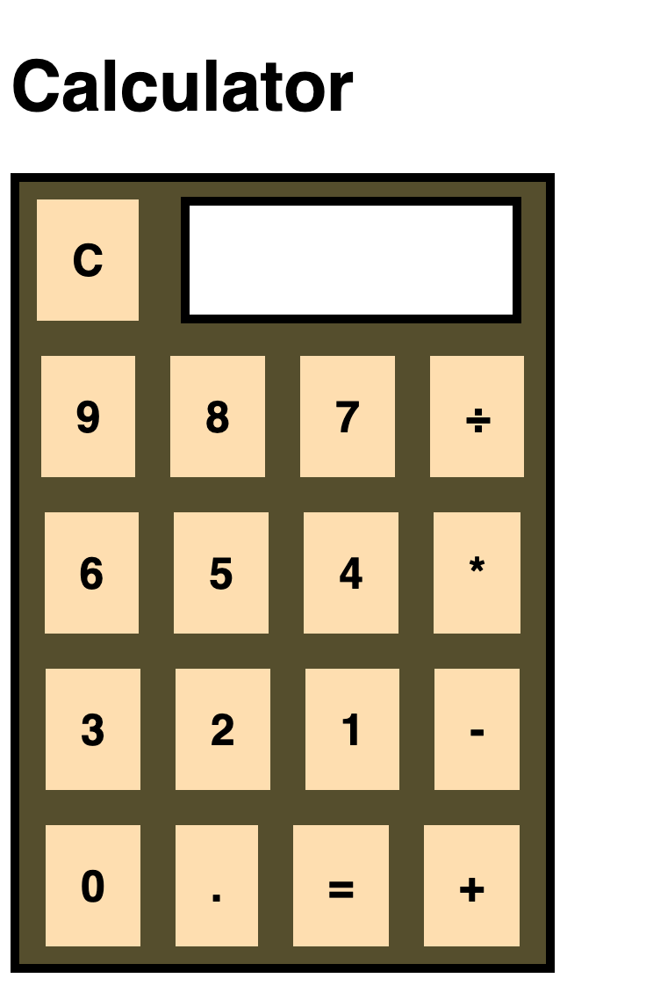

**Rachel's Javascript Calculator**

_A simple Calculator App created entirely in Javascript and HTML/CSS_

View it [here](https://rmuchow95.github.io/JavaScriptCalculator/)

**Summary**

This is my seventh project, created entirely with vanilla Javascript, HTML and CSS. With this application, I learned how to utilize Flex Box in my CSS file. This javascript calculator application also challenged my logic skills in new ways; after completing this application, I feel more skilled in creating clean and efficient code.

**Author**

Rachel Muchow
  
Full-Stack Web Developer
